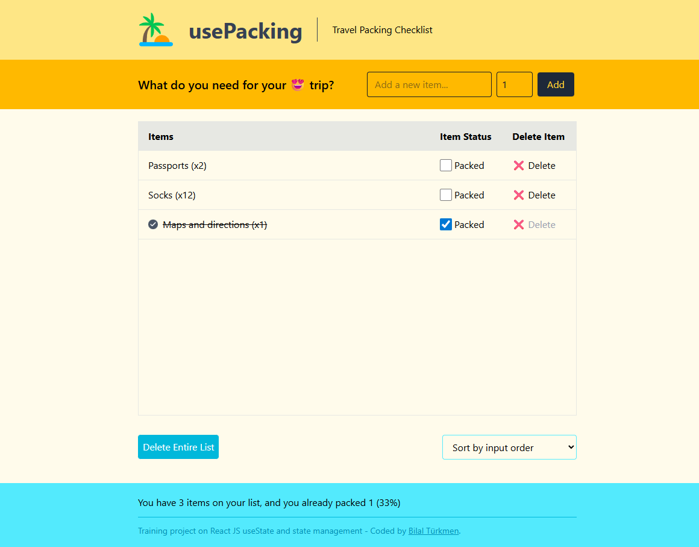

<h1>usePacking List</h1>

**Demo:** https://usepacking.netlify.app/

A React app focused on managing state effectively with `useState`, featuring a simple interactive packing list.

## 👍 My Challenges:

- Tailwind CSS has been applied.
- Improving the front-end design
- The delete button is disabled when the "Packed" option is selected.
- If the same word is entered, ignore the difference between uppercase and lowercase letters.
- The input Value is trimmed to avoid adding items with only whitespace.
- Some SVG icons were added as imported assets.

## 🎉 Build With:

- React JS + Tailwind CSS
- Semantic HTML5 markup
- CSS Flexbox and Grid
- Mobile-first workflow
- Custom CSS properties
